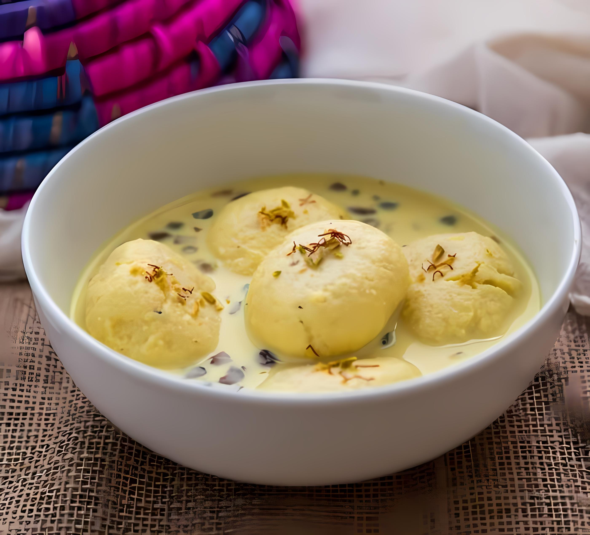
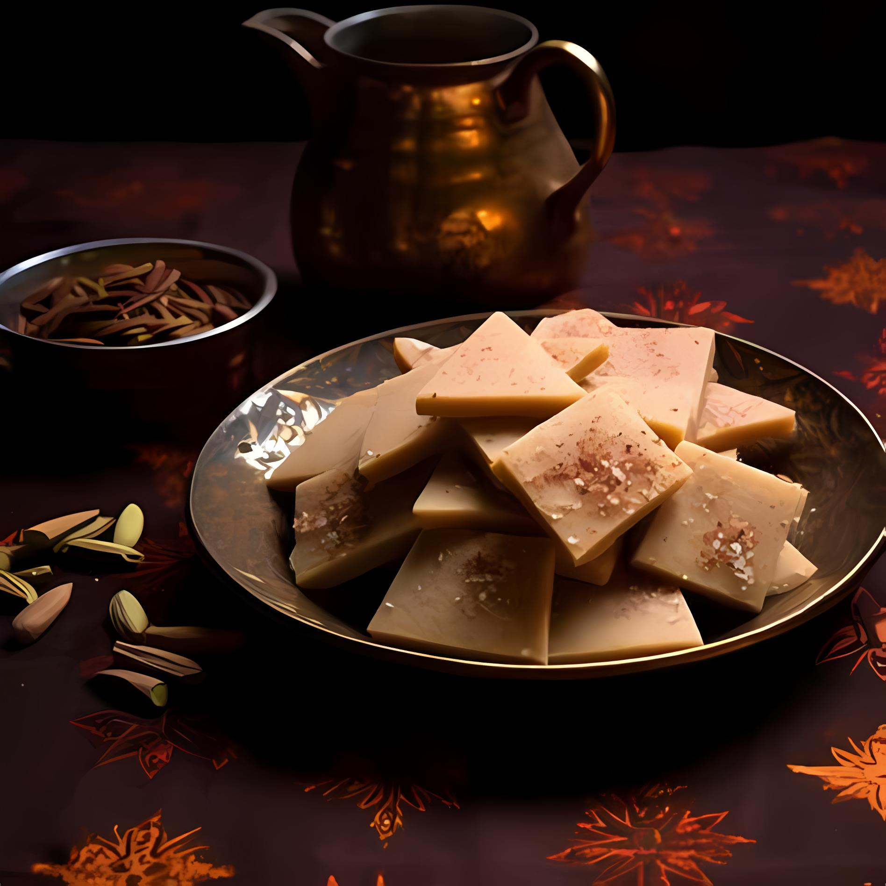
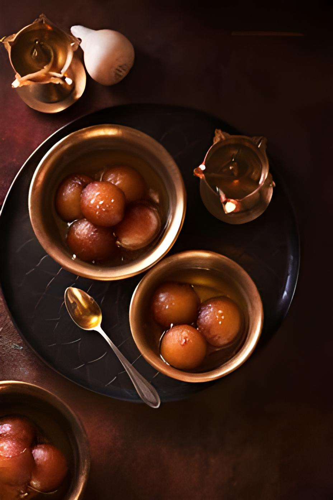

<!DOCTYPE html>
<html lang="en">
<head>
    <meta charset="UTF-8" />
    <meta name="viewport" content="width=device-width, initial-scale=1.0" />
    <title>Sudhamrit</title>
    <link href="https://fonts.googleapis.com/css2?family=Pacifico&family=Poppins:wght@300;400;600&display=swap" rel="stylesheet" />
    <link href="https://cdnjs.cloudflare.com/ajax/libs/font-awesome/5.15.4/css/all.min.css" rel="stylesheet" />
    <link href="/img/111.png" rel="icon">

    
</head>
<body>
    <header>
        <nav class="navbar">
            

                
            

            <ul class="nav-links" id="navLinks">
                <li><a href="index.html"><strong> Home </strong></a></li>
            </ul>
            

                
                
                
            

        </nav>
    </header>

    <!-- Products Section -->
    <section id="products" class="products">
        

            

                <h2>Our Products</h2>
                

                    Explore our delicious treats, handcrafted to perfection, and made
                    with the finest ingredients.
                

            

            

                <!-- Static Products -->
                

                    

                        

                            
                        

                        

                            <h3>Ras Malai</h3>
                            
Soft, syrupy, and melt-in-your-mouth Indian delicacy.

                        

                    

                

                

                    

                        

                            
                        

                        

                            <h3>Kaju Katli</h3>
                            
Smooth, diamond-shaped cashew fudge infused with pure nuts.

                        

                    

                

                

                  

                    

                      
                    

                    

                      <h3>Kaju Barfi</h3>
                      
Luxuriously creamy cashew fudge with cardamom.

                    

                  

                

                

                  

                    

                      
                    

                    

                      <h3>Gulab jamun</h3>
                      
Soft milk-based dumplings in aromatic sugar syrup.

                    

                  

                

                

                  

                    

                      
                    

                    

                      <h3>Mysore Pak</h3>
                      
Rich sweet made with gram flour, ghee, and sugar.

                    

                  

                

                

                  

                    

                      
                    

                    

                      <h3>Besan Laddu</h3>
                      
Traditional sweet made from roasted gram flour and ghee.

                    

                  

                

                

                  

                    

                      
                    

                    

                      <h3>Jalebi</h3>
                      

                        Crispy, syrupy spirals with a perfect blend of sweet and tangy
                        flavors.
                      

                    

                  

                

                

                  

                    

                      
                    

                    

                      <h3>Rasgulla</h3>
                      
Soft, spongy cheese balls soaked in light sugar syrup.

                    

                  

                

                

                  

                    

                      
                    

                    

                      <h3>Motichoor Laddu</h3>
                      

                        Tiny gram flour balls sweetened and combined into a delightful
                        sphere.
                      

                    

                  

                

                

                  

                    

                      
                    

                    

                      <h3>Malai Ghevar</h3>
                      
Dense, rich milk-based sweet with a caramelized texture.

                    

                  

                

                

                  

                    

                      
                    

                    

                      <h3>Paneer Barfi</h3>
                      

                        Flaky, melt-in-mouth sweet made with gram flour and cardamom.
                      

                    

                  

                

                

                  

                    

                      
                    

                    

                      <h3>Kalakand</h3>
                      
Grainy milk cake garnished with nuts and cardamom.

                    

                  

                

                

                  

                    

                      
                    

                    

                      <h3>Kesar Peda</h3>
                      
Saffron-flavored milk fudge with rich, creamy texture.

                    

                  

                

                

                  

                    

                      
                    

                    

                      <h3>Dry Fruit ladoos</h3>
                      
Rich dry fruits pudding made with pure ghee and cardamom.

                    

                  

                

                

                  

                    

                      
                    

                    

                      <h3>Coconut Barfi</h3>
                      
Traditional coconut pudding with nuts and cardamom.

                    

                  

                

                

                  

                    

                      
                    

                    

                      <h3>Malai Cham Cham</h3>
                      
Cream-filled oval-shaped sweet topped with coconut.

                    

                  

                

                

                  

                    

                      
                    

                    

                      <h3>Besan Burfi</h3>
                      
Dense milk fudge squares with cardamom flavor.

                    

                  

                

                

                  

                    

                      
                    

                    

                      <h3>Chocolate KajuKatali</h3>
                      

                        Chocolate kajukatli is a delicious fusion of traditional
                        kajukatli and rich chocolate, sweet, nutty flavor of cashews
                        with the indulgence of cocoa.
                      

                    

                  

                

                

                  

                    

                      
                    

                    

                      <h3>Anjeer Barfi</h3>
                      
Fig and milk fudge with chopped nuts.

                    

                  

                

                

                  

                    

                      
                    

                    

                      <h3>Payasam</h3>
                      

                        Pal Payasam is a creamy, sweet South Indian rice pudding made
                        with milk, sugar, and flavored with cardamom, offering a
                        comforting and rich dessert experience. .
                      

                    

                  

                

                

                  

                    

                      
                    

                    

                      <h3>Mango cupcake</h3>
                      
Mango-flavored milk fudge with real fruit pulp.

                    

                  

                

                

                  

                    

                      
                    

                    

                      <h3>Coconut Laddu</h3>
                      
Sweet spheres made with fresh coconut and condensed milk.

                    

                  

                

                

                  

                    

                      
                    

                    

                      <h3>Dry Fruit Laddu</h3>
                      
Mixed nuts and dried fruits formed into sweet balls.

                    

                  

                

                

                  

                    

                      
                    

                    

                      <h3>Kesar kajukatli</h3>
                      
Saffron-flavored kajukatli in creamy milk.

                    

                  

                

                

                  

                    

                      
                    

                    

                      <h3>imarti</h3>
                      
Cream-based sweet discs with cardamom flavor.

                    

                  

                

                

                  

                    

                      
                    

                    

                      <h3>Darbari Khaja</h3>
                      
Crispy-flavored khaja sweet with pistachios.

                    

                  

                

                

                  

                    

                      
                    

                    

                      <h3>awiss albania</h3>
                      

                        Swiss Albania refers to the unique blend of Swiss and Albanian
                        cultures, often highlighting the picturesque landscapes and
                        strong traditions that unite both countries. .
                      

                    

                  

                

                

                  

                    

                      
                    

                    

                      <h3>peanut date delight</h3>
                      

                        Makevit is a versatile, nutritious food supplement made from
                        wheat flour, often used to boost energy and provide essential
                        vitamins and minerals. .
                      

                    

                    nuts
                  

                

                

                  

                    

                      
                    

                    

                      <h3>Kaju Nnakhatai</h3>
                      

                        Kaju Nanakhatai is a rich, buttery Indian shortbread cookie
                        made with cashew nuts, ghee, and flour, offering a delightful
                        melt-in-your-mouth texture. .
                      

                    

                  

                

                

                  

                    

                      
                    

                    

                      <h3>assorted cupcake</h3>
                      

                        Cupcakes are individual, miniature cakes often topped with
                        frosting and sprinkles, offering a sweet, customizable treat
                        perfect for any occasion.
                      

                    

                  

                

                

                  

                    

                      
                    

                    

                      <h3>Kher kadam</h3>
                      

                        Kheer Kadam is a popular Bengali sweet made of milk-based
                        khoya (mawa) filled with rasgulla, offering a delightful
                        combination of creamy and spongy textures..
                      

                    

                  

                

                

                  

                    

                      
                    

                    

                      <h3>pineapple patrani</h3>
                      

                        It is a flavorful dish where pineapple slices are marinated
                        with a mix of spices and herbs, then wrapped in banana leaves
                        and steamed to create a fragrant, tangy, and tropical treat. .
                      

                    

                  

                

                

                  

                    

                      
                    

                    

                      <h3>rajwadi peda</h3>
                      

                        Rajwadi Peda is a rich, indulgent Indian sweet made from
                        condensed milk, sugar, and ghee, often garnished with nuts and
                        flavored with cardamom, offering a royal, melt-in-your-mouth
                        experience. .
                      

                    

                  

                

              

            

    </section>

    

      
&copy; 2024 Sudhamrit. Crafted with ❤️. All Rights Reserved.

  

    
</body>
</html>